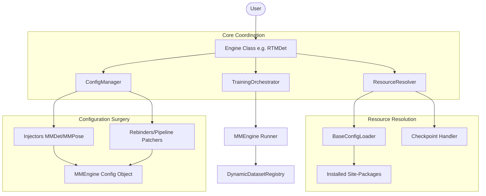

# Model Integration Guide

This guide outlines the standard procedure for integrating a new OpenMMLab model into the `ez_openmmlab` framework, ensuring it adheres to the project's **SOLID** architecture and **Context-Aware** philosophy.

---

## 🧩 Architectural Overview

The following diagram illustrates how the core components collaborate to transform a high-level user request into a functioning OpenMMLab engine.

---

## Phase 1: Foundation (Schemas & Constants)

Before writing the model logic, you must register its identity and configuration mapping.

1.  **Update `src/ez_openmmlab/core/schema/models.py`**:
    *   Add a new entry to the `ModelName` Enum.
    *   Create a dictionary mapping the Enum name to its official OpenMMLab `.py` config path (relative to the library's `configs/` root).
    *   Add the new mapping to the `SUPPORTED_CONFIGS` aggregate.

---

## Phase 2: Parameter Intelligence (Resolvers)

If your model requires derived parameters (e.g., calculating heatmap sigma from input resolution), implement a Resolver.

1.  **Create a Resolver in `src/ez_openmmlab/core/resolvers/`**:
    *   Inherit from `BaseModelParamsResolver`.
    *   Implement `resolve(**kwargs)`: This method should handle defaults and validate parameter compatibility.
2.  **Register in `ModelParamsResolverFactory`**:
    *   Update `src/ez_openmmlab/core/resolvers/factory.py` to return your new resolver based on the model name.

---

## Phase 3: The Model Engine (User Interface)

This is the primary user-facing class. Place it in `src/ez_openmmlab/models/<library_family>/`.

### 1. Inherit from the Family Base
*   Detection: `EZMMDetector`
*   Pose: `EZMMPose`
*   New families: `EZMMLab`

### 2. Implement the "DNA" Methods
*   `_get_architecture_params`: **Critical.** Return a dict of parameters (like `input_size`) that must be saved to `user_config.toml`. These are "experiment-locked" during resumption.
*   `_get_library_family`: Return the string identifier (e.g., `"mmdet"`, `"mmpose"`).

### 3. Implement the Training Interface
To adhere to **Interface Segregation**, you must implement two distinct methods:

*   **`train(...)`**: Strictly for fresh starts. Requires `dataset_config_path`.
*   **`resume(...)`**: Strictly for continuing unfinished runs. Signature uses `Optional` defaults.

---

## Phase 4: Inner Wiring (Surgery)

The "Surgery" system is now centralized in `src/ez_openmmlab/core/surgery/`.

### 1. Value Patching (Injectors)
Modify the family-specific injector in `src/ez_openmmlab/core/surgery/injectors/` (e.g., `mmdet.py` or `mmpose.py`) to update specific values in the `Config` object.

### 2. Structural Synchronization (Rebinders)
If your model config "bakes in" duplicate object references, use a Rebinder in `src/ez_openmmlab/core/surgery/rebinders.py`. This ensures all internal pointers stay synchronized after patching.

---

## Phase 5: Smart Resumption Logic

The base engine handles most of this by looking for:
1.  **`user_config.toml`**: The source of truth.
2.  **`best_*.pth`**: The weights.

When a user calls `Model(model="path/to/user_config.toml")`, the `ResourceResolver` automatically recovers the experiment state.

---

## Implementation Checklist

| Component | Responsibility | File Location |
| :--- | :--- | :--- |
| **Enum** | Identity & Config Path | `core/schema/models.py` |
| **Resolver** | Logic for derived params | `core/resolvers/` |
| **Injector** | Patching values | `core/surgery/injectors/` |
| **Rebinder** | Wiring config refs | `core/surgery/rebinders.py` |
| **Model Class** | User Interface | `models/<family>/<name>.py` |
